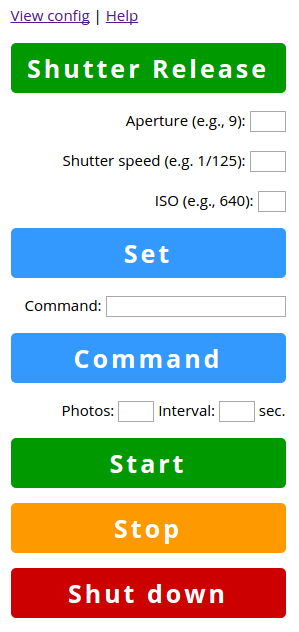

## gPhoto2 Bottle

gPhoto2 Bottle is a simple web app based for controlling cameras supported by gPhoto2 software. The app is based on the Bottle framework. The app is designed for use with Raspberry Pi, but it should run on any Debian machine.

## Install and Run

1. Clone the project's repository using the `git clone https://github.com/dmpop/gphoto2-bottle.git` command. Switch to the resulting *gphoto2-bottle* directory.
2. Compile then gPhoto 2.5.2 by running the `sudo ./gphoto2-updater.sh` command.
3. Install the Bottle framework using the `sudo apt-get install python-pip` and `sudo pip install bottle` commands.
4. Launch the app by running the `sudo ./gphoto2-bottle.py` command.
5. Point the browser to http://127.0.0.1.8080/ (replace *127.0.0.1* with the actual IP address of the server) to access and use the app.
