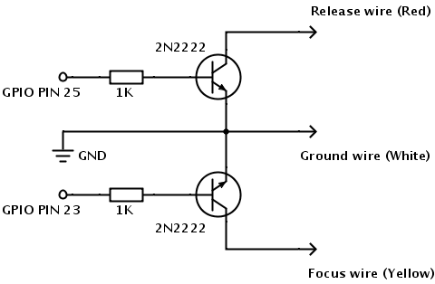
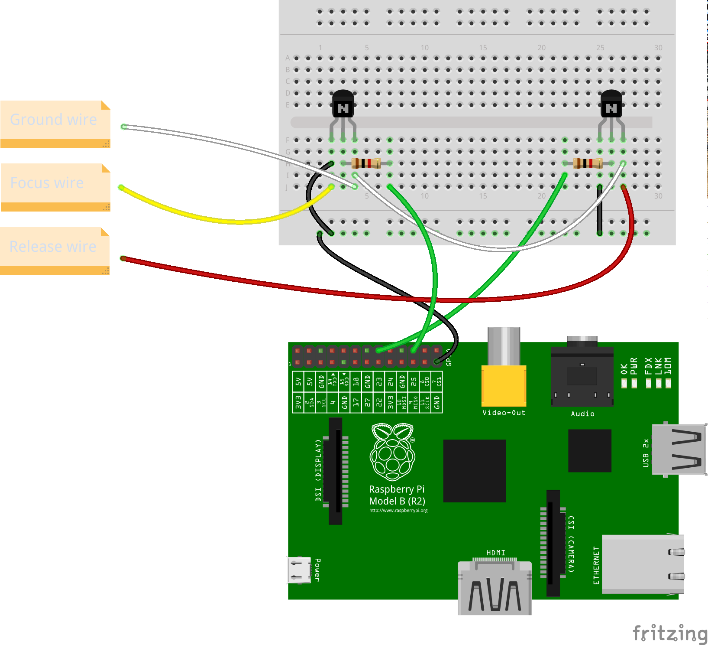

## gPhoto2 Bottle

gPhoto2 Bottle is a simple web app based for controlling cameras supported by [gPhoto2](http://www.gphoto.org/) software. The app is based on the [Bottle](http://bottlepy.org/) framework. The app is designed for use with Raspberry Pi, but it should run on any Debian or Ubuntu machine.

## Features

gPhoto Bottle allows you to perform the following actions:

- Transfer existing photos from the camera to the server
- Take single shot
- Change basic camera settings, including aperture, shutter speed, and ISO
- Take a user-defined number of shots at specified intervals
- List the supported configuration options

### Remote Cable Shutter Trigger

gPhoto2 Bottle also provides an interface for controlling a transistor-based remote cable shutter trigger. To switch to the interface point the browser to http://127.0.0.1.8080/trigger (replace *127.0.0.1* with the actual IP address of the machine running gPhoto2 Bottle). This part of the app is designed for use with Raspberry Pi and Sony NEX and Alpha series cameras, but it should work with any camera that can be  triggered by a simple transistor switch shown below.

Use the following diagram to wire the transistor switch and connect it to the camera and Raspberry Pi:

## Dependencies

* Python
* Python Bottle
* gPhoto2
* Git (optional)

## Install and Run

1. Clone the project's repository using the `git clone https://github.com/dmpop/gphoto2-bottle.git` command. Switch to the resulting *gphoto2-bottle* directory.
2. Install the Bottle framework using the `sudo apt-get install python-pip` and `sudo pip install bottle` commands.
3. Launch the app by running the `sudo ./gphoto2-bottle.py` command.
4. Make sure that your camera connected to the machine running gPhoto2 Bottle via a USB cable.
5. Point the browser to http://127.0.0.1.8080/ (replace *127.0.0.1* with the actual IP address of the machine running gPhoto2 Bottle) to access and use the app.
